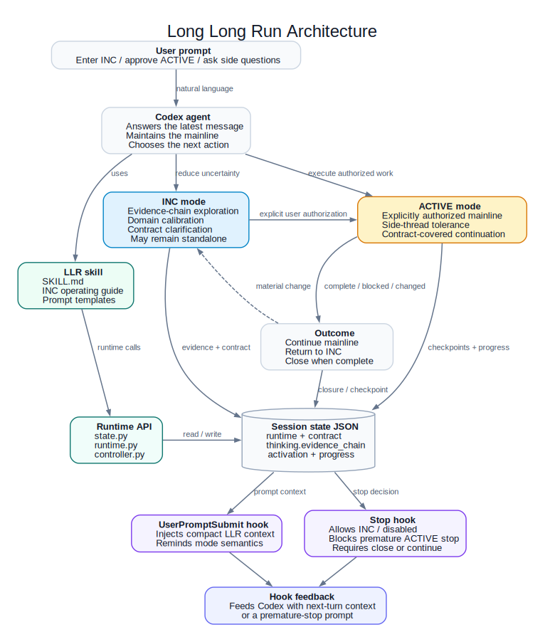

# Long Long Run

<p align="center">
  
</p>

<p align="center">
  
</p>

<p align="center">
  <strong>Agent-first long-run harness for Codex.</strong>
</p>

Long Long Run (LLR) is a plug-and-play Codex skill for serious agent work: INC evidence-chain exploration, domain calibration, durable project understanding, ACTIVE authorized mainlines, side-thread tolerance, and Codex hook-enforced stop guards.

LLR is prompt-driven. Users normally do not operate it through CLI commands. Install it as a Codex skill, then ask Codex to use LLR in natural language.

<p>
  <strong>⚠️ Hook required:</strong> LLR depends on Codex hooks. Make sure hooks are enabled in Codex before relying on LLR's runtime context or ACTIVE stop guard.
</p>

## Start With These Prompts

<p align="center">
  <strong>🎬 Real demo video coming soon</strong><br>
  <span>INC exploration → ACTIVE authorization → side-thread tolerance → hook-enforced continuation</span>
</p>

<p>
  <strong>💡 Remember:</strong> The more objective noise you remove in INC, the more predictable ACTIVE becomes. Use INC to converge on the right contract before asking Codex to execute.
</p>

LLR is used through natural-language prompts. These examples show the three common user moves.

### Enter INC

```text
Use longlong run in INC mode to deeply explore [project/problem]. Help me clarify the real goal, hidden requirements, risks, hard acceptance criteria, and your recommended detailed contract.
```

### Enter ACTIVE

```text
I approve this plan. Enter LLR ACTIVE, write the hard acceptance goals into LLR, and start implementation.
```

### Return To INC

```text
Exit LLR ACTIVE and return to INC mode.
```

## What LLR Does

| Capability | What it helps Codex do |
| --- | --- |
| INC | Explore, clarify, and build an evidence-backed contract before or without implementation. |
| ACTIVE | Continue an authorized mainline through clear next steps without premature stopping. |
| Evidence chain | Keep current facts, assumptions, risks, and next actions aligned. |
| Domain calibration | Discover expert framing and current practice before validating candidate methods. |
| Side-thread tolerance | Answer interruptions without losing the main objective. |

LLR is not a project management system, memory archive, or questionnaire. It stores only the current durable truth that helps the agent continue responsibly.

<details>
<summary>Architecture diagram</summary>

<p align="center">
  
</p>

</details>

## When To Use LLR

| Use LLR for | Skip LLR for |
| --- | --- |
| deep project exploration | tiny one-shot edits |
| domain research before implementation | direct factual answers |
| unclear or evolving requirements | tasks with no useful continuing context |
| benchmark and evaluation design | |
| long-running experiments or monitoring | |
| repo recovery or project takeover | |
| multi-step implementation with hard acceptance gates | |
| tasks where side conversations should not erase the main objective | |
| decision support where INC alone is valuable | |

<details>
<summary>INC and ACTIVE modes</summary>

<p><strong>INC Mode</strong></p>

<p>INC means Intent Noise Cancellation.</p>

<p>Use INC when the task needs exploration, clarification, domain calibration, project archaeology, research, validation, or decision support before committing to implementation.</p>

<p>INC can:</p>

<ul>
  <li>inspect files</li>
  <li>run commands</li>
  <li>search the web when current domain practice matters</li>
  <li>create small probes</li>
  <li>make bounded changes when that is the best way to obtain evidence</li>
  <li>infer hidden requirements</li>
  <li>propose acceptance criteria</li>
  <li>surface expert defaults</li>
  <li>identify risks and open decisions</li>
</ul>

<p>INC can be the whole workflow. It does not have to lead to ACTIVE.</p>

<p>The key rule: INC may build understanding, but it does not mean the user has authorized Codex to carry the work as the committed mainline.</p>

<p><strong>ACTIVE Mode</strong></p>

<p>ACTIVE means the user has explicitly authorized Codex to pursue the agreed contract as the mainline.</p>

<p>ACTIVE is for implementation, delivery, monitoring, recovery, long experiments, and other work where Codex should keep moving through clear contract-covered next steps instead of stopping after every useful local update.</p>

<p>ACTIVE keeps the mainline alive while still allowing normal conversation. If the user asks a side question, Codex should answer it first, then resume the mainline unless the side question changes the contract, blocks the work, or requires returning to INC.</p>

</details>

<details>
<summary>Evidence chain and discovery-before-validation</summary>

<p><strong>Evidence Chain</strong></p>

<p>LLR is built around current effective evidence.</p>

<p>A useful evidence chain connects:</p>

<ul>
  <li>what the user asked for, corrected, rejected, or emphasized</li>
  <li>what the project files, commands, data, logs, or artifacts show</li>
  <li>what domain practice or expert standards imply</li>
  <li>what assumptions are still unverified</li>
  <li>what risks matter</li>
  <li>what should happen next</li>
</ul>

<p>If evidence is overturned, it should be removed or replaced in the current evidence chain. The history can be recorded briefly in a checkpoint, but stale evidence should not keep steering the task.</p>

<p><strong>Discovery Before Validation</strong></p>

<p>When domain expertise matters, Codex should not only search for the answer it already expects.</p>

<p>Good INC exploration starts from the user's wording, project vocabulary, file names, data labels, metrics, artifact type, audience, quality words, failure symptoms, tools, and ecosystem terms. From there, Codex should discover how experts frame the problem before validating candidate methods.</p>

<p>This is especially important for:</p>

<ul>
  <li>research planning</li>
  <li>medical, legal, financial, or safety-sensitive work</li>
  <li>fast-moving tools and libraries</li>
  <li>benchmarks and evaluation protocols</li>
  <li>design conventions</li>
  <li>academic or industry best practices</li>
  <li>tasks where the user may not know how to define success yet</li>
</ul>

</details>

<details>
<summary>Prompting principles</summary>

<p>For best results:</p>

<ul>
  <li>name the mode explicitly: INC or ACTIVE</li>
  <li>say whether implementation is allowed</li>
  <li>give Codex the project, domain, artifact, or decision context</li>
  <li>ask for evidence chain, expert defaults, risks, and open decisions</li>
  <li>require hard acceptance criteria when the goal is deliverable-oriented</li>
  <li>keep extrapolated needs visible instead of implicit</li>
  <li>authorize ACTIVE explicitly</li>
  <li>mark side questions as side threads</li>
  <li>return to INC when new evidence changes the contract</li>
</ul>

</details>
